# 21 天转型微服务实战营笔记

## 第 1 章 WEEK1 初步了解并教你搭建你的微服务

### 1.1 DAY1 微服务架构知识介绍

大纲

* 微服务简介
* 容器与容器平台
* 微服务架构模式
* 微服务开发框架
* Service Mesh
* 微服务平台

#### 什么是微服务

微服务架构是一种架构模式，它要求开发者以一种不同于以往的开发方式进行软件开发，设计功能比较单一，拥有接口的服务，它们都可以被独立地构建、测试和部署。

微服务得益于 DevOps 文化的发展和持续集成工具的成熟。随着越来越多的公司向敏捷转型，微服务架构模式可以指导企业开发出具有可伸缩、弹性、高可用的系统，将上线频率从以往的几个月缩短为几周甚至几天。

传统软件是由单一服务构成，而微服务提倡将软件按照功能模块进行划分。

#### 为什么使用微服务

* **独立运行**：服务异常不再彼此影响，必要时将非核心功能隔离，不影响主要功能运转。一个服务实例崩溃不会影响其他实例，整体系统依然正常。按功能伸缩，当某个模块算力需求变化时，只进行该功能实例的伸缩，而不是整个系统的伸缩，减少资源浪费。
* **独立升级**：一个小特性的更改或者 bug fix 不会影响大部分功能的正常运转。
* **代码复用**：一套代码可以用于不同的独立系统中，在公司内部或者开源社区中进行分享。例如：支付服务、用户管理服务、认证鉴权。
* **技术演进**：单体服务使用陈旧的技术时，升级变得困难。例如，从 struts1 + spring 升级到 struts2，再到完全切换到 Spring MVC，不断地切换框架为工程稳定性带来风险，而陈旧的框架又无人维护。微服务项目不受旧代码拘束。
* **语言限制**：当你发现某个新功能更适合使用 Go 而不是 Java 时，微服务架构让开发者能根据服务场景选择合适的语言。招聘开发者也不必局限于特定语言。
* **团队管理**：小团队运作更加敏捷，配合紧密，开发周期短，组织扩张灵活。

#### 历史

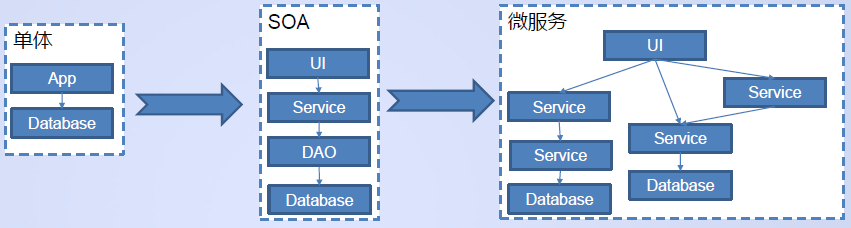

微服务的演进历史是漫长的，从单体的 MVC 架构到分布式 SOA 架构，在结合了敏捷开发、DevOps 等理念后最终诞生了微服务。一个很好的印证是，在我深入地实践了 DevOps 和敏捷开发后，自发地开始萌芽了微服务的思想理论。

微服务最早出现在国内是在 2015 年初的时候，成功的案例有 AWS 以及 Netflix 等公司。

EC2 最早是亚马逊内部使用的一个服务，最终被作为一种服务对外提供成为 AWS，而基于微服务架构，AWS 基于现有的服务之上快速迭代新的产品，丰富 AWS 能力，现在已经拥有 100 多种不同的服务，回报是巨大的。

华为很早便践行了微服务理论并对外开源了微服务相关项目，华为云得益于微服务架构快速推出大量新的云服务。

#### 微服务面临的挑战

1. **持续集成**：大量的工程，需要一个持续集成工具自动完成编译、打包、发布、部署等工作。
2. **版本管理**：大量的版本，就会遇到兼容性问题。你需要让项目可控。
3. **文档管理**：版本在持续升级，服务接口不匹配。你需要一个文档管理系统，并让开发者严格遵守文档进行开发。
4. **生命周期管理**：服务运行期，需要一个平台管理服务，除了部署、启停，还要能够在服务崩溃时自动拉起服务。
5. **运维**：运维人员操作服务、查看指标、日志、分布式调用链，更改配置项都由于微服务架构而变得比以往更加复杂。
6. **调试**：在开发期，如果依赖于很多微服务，如何方便地在本地去调用依赖的服务。
7. **网络调用**：从过去本地的内存栈调用变为了网络调用，不再可靠。
8. **安全**：如何控制不让未经授权的调用者访问到自己的数据。
9. **如何云服务化**：转型微服务涉及一系列的工作，处理以上复杂的问题需要大量的基础代码研发，如何能驾驭诸多的技术和文化变更。

#### 构建微服务系统是困难的

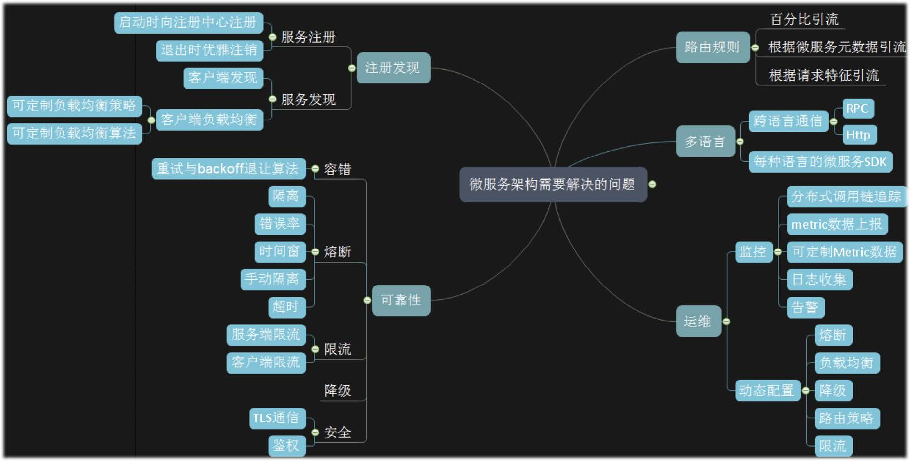

接下来的章节中将简单介绍微服务模式带来的问题的解决方式，并在后续课程中进行实战。

#### 容器与容器平台

可以学习 day1-day4 的内容来了解相关技术：https://activity.huaweicloud.com/21days_cce/index.html

容器的出现帮助了微服务技术体系的成熟，这是至关重要的一环。

容器和微服务是天生一对。在过去的虚拟机时代中，VM 的启停甚至长达数分钟。在进行弹性伸缩时，假设你设置了这样的伸缩条件"CPU 负载高于 80% 时，新增一台机器"，那么很可能在你没有得到一台新机器前，现存的 VM 中的服务就已经被压垮，继而引发级联崩溃。

容器的启停只需要数秒，并且由统一的容器平台管理全生命周期，为微服务系统提供了运行条件。从以往以虚拟机为中心的管理变为了以服务为中心的管理，让开发者专注于应用本身。

#### 微服务模式—注册发现

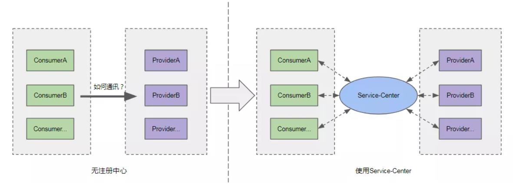

注册发现是微服务的基础，每个微服务实例都要注册自己的信息与地址到注册中心中，每个实例都在注册中心中查询自己需要访问的实例信息与真实地址。

Service Center 是华为云提供的一个典型的注册中心，帮助服务间进行注册与发现。

注册中心优点：

1. 解耦服务提供者与服务消费者，服务消费者不需要硬编码服务提供者地址。
2. 服务动态发现及可伸缩能力，服务提供者实例的动态增减能通过注册中心动态推送到服务消费者端。
3. 通过注册中心可以动态地监控服务运行状态。

#### 微服务模式—路由管理

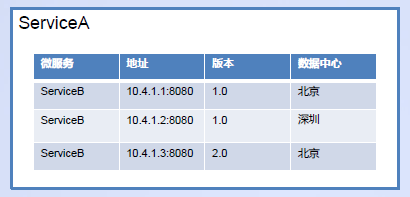

微服务 A 已经根据微服务名查询到了相关的实例信息并放置于本地内存，如上图表格所示。那么如何决定自己到底要选择哪一批实例进行访问呢？

可以看到每个实例都具有一定的属性，上表中有 2 个属性版本与数据中心。那么编写算法根据微服务名和属性筛选服务实例，最终就可以决定要访问的服务实例的集合了。

#### 灰度发布

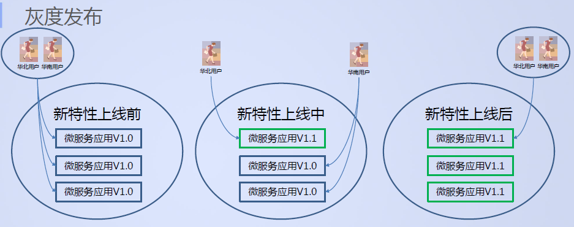

路由管理可以为我们解决什么问题？

灰度发布就是一个典型的场景。原本系统中运行着 1.0 版本的服务，我们可以将部分用户的流量迁移到新版本 1.1 中，让部分用户优先试用。最终将所有流量迁移到新版本中。

#### 微服务模式—客户端负载均衡

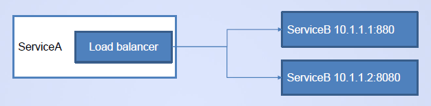

当在路由过程中决定了一个实例集合后，就可以对集合实行负载均衡算法，选择其中一个实例访问。这就是客户端负载均衡，区别于 nginx 这样的传统负载均衡组件，负载均衡直接在客户端（你的业务进程内部）进行。

#### 微服务模式—熔断

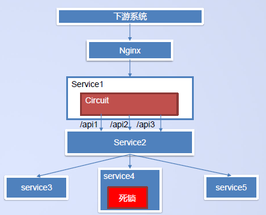

当服务发生错误、超时等问题时，系统需要将这部分非核心功能隔离，以免引起级联崩溃。

如上图，Service1 调用 api2 访问 service4 完成一个业务。当这个 api2 出现死锁时，将引起下游未做超时处理服务沾满线程池，最终大范围瘫痪，导致其他功能失效。想象一个更加庞大的系统，这将是一个巨大的灾难，异常将被放大。

如果能够在访问 api2 达到一定超时次数就将其隔离，不再发生网络调用，那么就不再产生新的死锁，系统稳定性就会提升。

这就像战舰的隔离仓原理，当遇到漏水的船舱时要将有问题的船舱隔离以避免灾难蔓延。

#### 微服务模式—容错

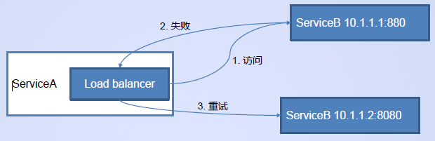

当一个请求失败时，可以尝试对同一个地址进行重试或者从负载均衡中选取一个新的地址进行重试。

#### 配置管理

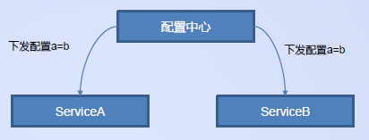

服务分布在各个服务器中，在需要更改配置时，我们不想登录到每个机器上进行文件编辑，并进行服务重启，配置中心能够解决这个问题。

当你遇到配置变更时，只需要在配置中心中进行更改，各个服务受到变更消息后，进行更改并在运行时生效。

Day5 将详细介绍。

#### 监控

日志：分布式系统庞大，无法再传统地登录到服务器上去查看日志，需要将日志上报并统一汇聚到一个监控系统中。

分布式调用链追踪：网络的调用不同于本地调用，就像本地调用可以用工具分析，分布式的网络调用也需要被监控起来，并在监控系统中进行分析以便随时掌握系统调用状况，分析服务性能瓶颈等。

指标：指标分为通用指标（如 CPU、内存、请求数量、延迟等）以及自定义指标（如用户注册量、商品购买量等）。

华为的 APM 服务是一个监控平台，能够支撑微服务系统的运行。开源中有 Prometheus、Zipkin、Elasticsearch、Kafka、TSDB 等大量服务可用于搭建一个监控系统。

#### 安全

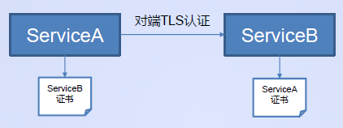

网络调用引起了安全访问的问题，使用对端 TLS 认证可以解决这个问题。

由 ServiceB、ServiceA 的开发者都签发证书，分发给彼此，两者加载对方证书，对彼此进行认证，以确定彼此真实身份。

#### API 管理

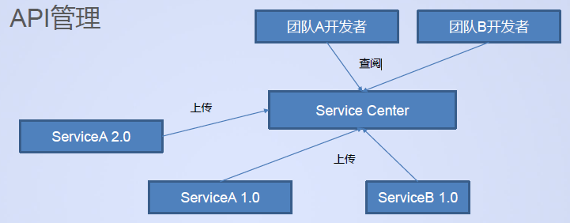

Service Center 不同于竞品独有的 API 文档管理能力，可以托管系统中所有服务的 API 文档，各个团队成员或者管理者可以在 Service Center 中查看服务文档，并以此为设计、开发依据。微服务版本与文档为绑定关系，提高了沟通效率以及可靠性。

#### 开发框架

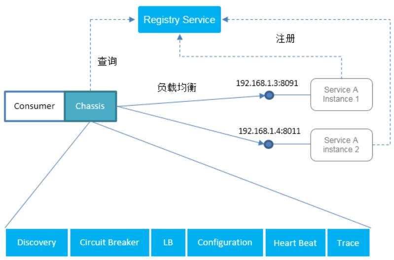

要完成以上的功能需要在微服务中编写代码，而这些代码都可以作为通用库来提供，这就是微服务开发框架。

开发者引入框架并学习开发方式，配置方式，就可以快速开发出具备微服务特性的应用。

我们称这种模式为 chassis，华为云提供 java-chassis 与 go-chassis 2 种语言框架，供用户选择。

Day2-14 课程将介绍如何使用框架进行开发。

#### Service Mesh

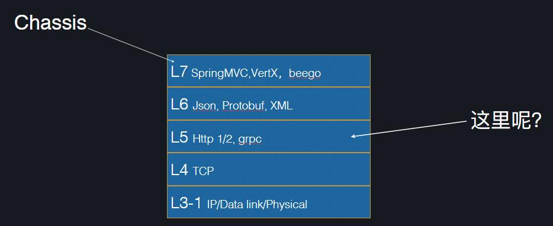

Service Mesh 同样解决微服务面临的问题，但是以另一种结题思路完成的。

我们在第 7 层使用各种开发框架，如传统开发框架 Spring MVC，微服务开发框架 java-chassis，go-chassis 等等，编码时直接调用。

那么微服务开发框架的功能下沉到 5 层呢。

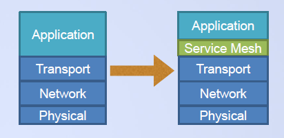

2017 年由 William Morgan 提出，一种基础设施层，服务间通信通过 Service Mesh 进行，一种 TCP/IP 之上的网络模型，轻量网络代理，与业务部署在一起，负责可靠传输复杂拓扑网络中的请求，将应用变为现代的云原生应用。

可以简单地理解为以前应用跑在 TCP/IP 之上，现在跑在 Service mesh 之上以处理微服务模式带来的问题。

Service Mesh 的专题将在 Day6 的直播中介绍。

#### 微服务平台

除了开发，微服务还需要解决的是将持续集成、基础设施、监控、中间件等功能组合在一起的平台为开发者提供良好的服务，这部分将在 Day15-21 介绍。

### 1.2 DAY2 微服务入门之编写 HelloWorld

大纲

* 开发第一个微服务
* 服务契约
* 开发服务调用者

#### 开发第一个微服务

创建一个空的 maven 工程，然后在 pom 文件中加入如下依赖：

```xml
<properties>
    <cse.version>2.3.62</cse.version>
</properties>

<dependencyManagement>
    <dependencies>
        <dependency>
            <groupId>com.huawei.paas.cse</groupId>
            <artifactId>cse-dependency</artifactId>
            <version>${cse.version}</version>
            <type>pom</type>
            <scope>import</scope>
        </dependency>
    </dependencies>
</dependencyManagement>

<dependencies>
    <dependency>
        <groupId>com.huawei.paas.cse</groupId>
        <artifactId>cse-solution-service-engine</artifactId>
    </dependency>
</dependencies>
```

> 创建一个简单的 CSEJavaSDK 微服务只需要引入`cse-solution-service-engine`包，但我们仍然推荐大家使用`<dependencyManagement>`管理依赖，这在项目依赖关系复杂时可以有效降低依赖管理复杂度。

创建一个`main`类：

```java
public class AppMain {
    public static void main(String[] args) throws Exception {
        Log4jUtils.init(); // 初始化默认的日志组件
        BeanUtils.init();  // 加载Spring bean定义文件，正式开始启动流程
    }
}
```

> CSEJavaSDK 使用的默认日志组件是`Log4J`，并且给出了一些默认的配置，可以开箱即用。

创建服务的 REST 接口类：

```java
@RestSchema(schemaId = "hello")        // 该注解声明这是一个REST接口类，CSEJavaSDK会扫描到这个类，根据它的代码生成接口契约
@RequestMapping(path = "/provider/v0") // @RequestMapping是Spring的注解，这里在使用Spring MVC风格开发REST接口
public class HelloService {
    @RequestMapping(path = "/hello/{name}", method = RequestMethod.GET)
    public String sayHello(@PathVariable(value = "name") String name) {
        return "Hello," + name;
    }
}
```

一个微服务可以有多个接口契约。这里使用`@RestSchema`注解声明`HelloService`是一个契约 id 为 hello 的 REST 接口，同时会在启动时生成相应的契约。

这里的 REST 接口是以 Spring MVC 风格开发的。CSEJavaSDK 支持的开发风格有 REST([JAX-RS](https://docs.servicecomb.io/java-chassis/zh_CN/build-provider/jaxrs.html)、[Spring MVC](https://docs.servicecomb.io/java-chassis/zh_CN/build-provider/springmvc.html))和[RPC](https://docs.servicecomb.io/java-chassis/zh_CN/build-provider/transparent-rpc.html)，开发者可以自由选用。

在`src\main\resources\`目录下创建一份`microservice.yaml`文件

```yaml
APPLICATION_ID: Training21Days-HelloWorld # 应用Id 是微服务的一个隔离层级，默认只有同应用下的微服务可以相互调用
service_description:
  name: provider # 微服务名称，同应用下的不同微服务需要有不同的名称
  version: 0.0.1 # 微服务版本
cse:
  service:
    registry:
      address: http://127.0.0.1:30100
      instance:
        watch: false # 使用pull模式连接服务中心
  config:
    client:
      serverUri: http://127.0.0.1:30100
      refreshMode: 1 # 使用pull模式连接配置中心
      refresh_interval: 5000
  monitor: # 只有从本地接入云上CSE时需要配置monitor地址，云上集群部署时可以通过服务发现接入monitor
    client:
      serverUri: http://127.0.0.1:30100
  rest:
    address: 0.0.0.0:8080 # 本服务监听的地址

  # 本地连接华为云时需要配置AK/SK，如果是在云上ServiceStage部署则不需要。直接删掉credentials配置即可
  credentials:
    accessKey: your ak # 配置你的AK
    secretKey: your sk # 配置你的SK
    project: cn-north-1 # 这里的值与sc/cc/monitor的地址相对应，如果配置的是域名，CSEJavaSDK可以自动截取出project
    akskCustomCipher: default
```

运行 AppMain 类，可以在 ServiceStage 的微服务控制台看到 provider 服务。

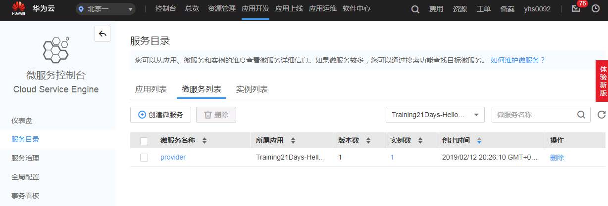

调用`http://127.0.0.1:8080/provider/v0/hello/Bob`，可以得到 provider 服务的应答。

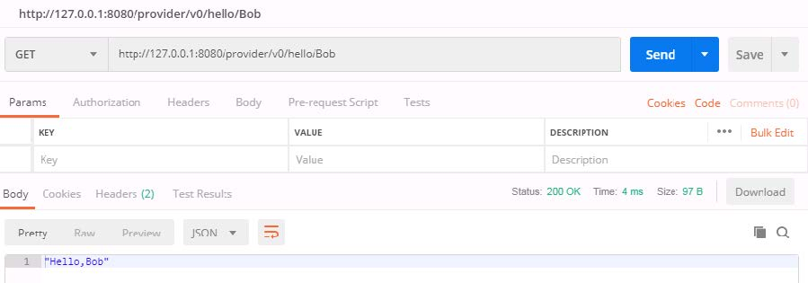

#### 服务契约

点击 provider 服务的记录查看详情，我们能看到一份服务契约。

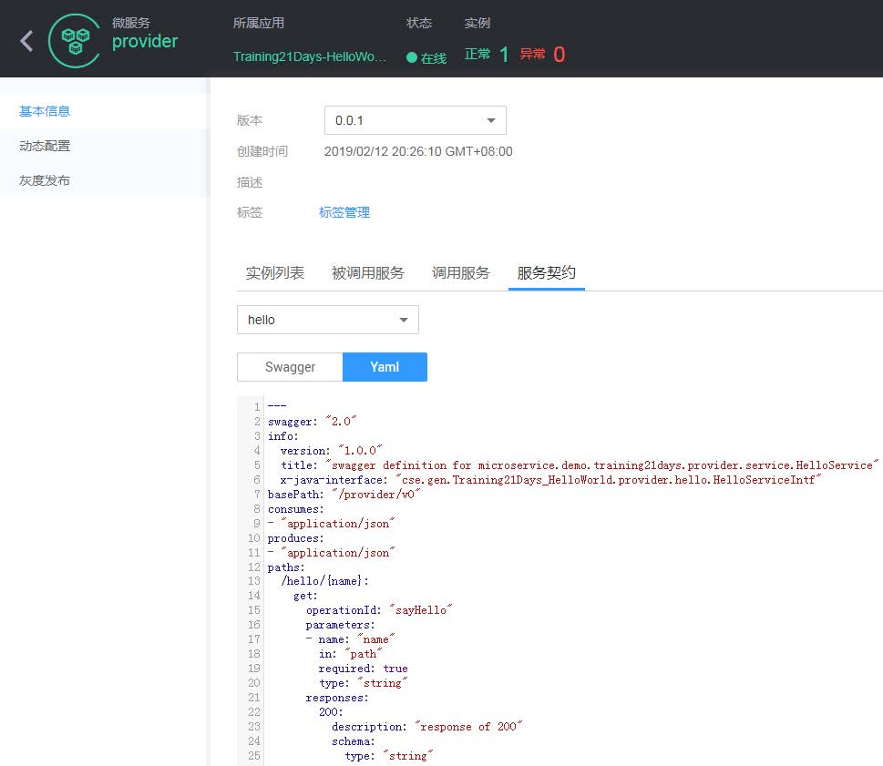

服务契约描述了微服务的接口，是在启动过程中由 CSEJavaSDK 根据微服务 REST 接口类（这里是 HelloService.java）自动生成的。如果你观察一下 provider 服务的启动日志，会发现在日志里也将生成的契约打印出来了。

服务契约不仅仅是一份接口文档，它也约束了 CSEJavaSDK 运行时接收请求和返回应答的行为。

CSEJavaSDK 使用的服务契约是 Swagger 契约，用户可以从网上搜索到相关资料。关于 REST 接口定义的约束，可以参考[接口定义和数据类型](https://docs.servicecomb.io/java-chassis/zh_CN/build-provider/interface-constraints.html)。

TIPS：

服务契约描述了服务的接口，因此契约内容的变化可以认为是服务接口变化了。在正式的生产环境中这应该是不允许随意发生的。

修改 provider 服务的接口，重启服务，可以发现服务启动失败，因为它的契约与服务中心中保存的契约不一致。

如果碰到这种问题，在正式的生产环境中推荐的处理方式是在`microservice.yaml`文件中升级微服务版本；开发环境也可以考虑删除服务中心里的 provider 服务记录，或者配置`service_description.environment=development`。

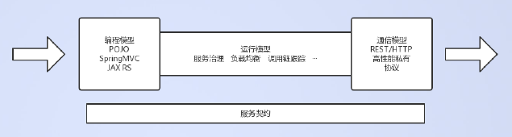

参见 ServiceComb 开源资料[ServiceComb-Java-Chassis 微服务系统架构](https://docs.servicecomb.io/java-chassis/zh_CN/start/architecture.html)，服务契约的作用贯穿 ServiceComb 的三个模型，而不是简单地作为接口文档。

服务契约将三个模型解耦，这使得运行模型中的同一套微服务治理逻辑既可以用于不同的开发风格代码，也可以用于不同的通信方式，让框架的功能扩展能力更好。同时接口契约规范了 provider 和 consumer 双方的交互行为，让开发与测试之间、不同微服务的开发之间的沟通协作效率更高。

CSEJavaSDK 作为一个带服务契约的 REST 开发框架，在使用上不会像传统的 Servlet 开发方式那么随心所欲，但随着系统规模扩大、复杂度提升，服务契约带来的好处将会明显大于其在开发方式上的限制。

#### 开发微服务调用者

开发一个 consumer 服务来调用 provider 服务，`pom.xml`文件和`main`类完全相同，定义一个 REST 接口类接收外部请求并调用 provider 服务：

```java
@RestSchema(schemaId = "helloConsumer")
@Path("/consumer/v0")  // 这里使用JAX-RS风格开发的consumer服务
public class HelloConsumerService {
    // RPC调用方式需要声明一个provider服务的REST接口代理
    @RpcReference(microserviceName = "provider", schemaId = "hello")
    private HelloService helloService;

    // RestTemplate调用方式需要创建一个 ServiceComb 的 RestTemplate
    private RestTemplate restTemplate = RestTemplateBuilder.create();

    @Path("/hello")
    @GET
    public String sayHello(@QueryParam("name") String name) {
        // RPC 调用方式体验与本地调用相同
        return helloService.sayHello(name);
    }

    @Path("/helloRT")
    @GET
    public String sayHelloRestTemplate(@QueryParam("name") String name) {
        // RestTemplate 使用方式与原生的Spring RestTemplate相同，可以直接参考原生Spring的资料
        // 注意URL不是 http://{IP}:{port} ， 而是 cse://{provider端服务名} ， 其他部分如path/query等与原生调用方式一致
        ResponseEntity<String> responseEntity =
                restTemplate.getForEntity("cse://provider/provider/v0/hello/" + name, String.class);
        return responseEntity.getBody();
    }
}
```

```java
// 定义RPC调用方式所使用的代理接口
public interface HelloService {
    // 方法名称与provider服务契约中的 operationId 保持一致
    // 参数顺序与provider服务契约中定义的顺序保持一致
    String sayHello(String name);
}
```

CSEJavaSDK 支持 JAX-RS、Spring MVC 和 RPC 三种开发风格，一般我们推荐用户使用前两种，配合 CSEJavaSDK 自动生成服务契约的能力开发更方便。

CSEJavaSDK 提供了两种微服务调用方式，[RPC 方式](https://docs.servicecomb.io/java-chassis/zh_CN/build-consumer/develop-consumer-using-rpc.html)和[RestTemplate](https://docs.servicecomb.io/java-chassis/zh_CN/build-consumer/using-resttemplate.html)方式。

consumer 服务的`microservice.yaml`文件与 provider 服务基本一致，但是注意它的服务名称需要改为“consumer” ，服务监听地址改为“`0.0.0.0:9090`” 。

启动 consumer 服务，可以在 ServiceStage 的微服务控制台看到 consumer 服务。调用 consumer 服务的两个接口，可以看到通过 RPC 方式和 RestTemplate 方式都能够成功调用 provider。


> 所用的代码是很多年前的，虽然不影响运行，但是还是参考 ServiceComb 最新的代码比较好。不过开源的 ServiceComb 和华为云商业化的 CSE 不完全一样，华为云的示例代码版本也比较旧。

### 1.3 DAY3 感知微服务和 CSE 的交互

大纲

* 服务中心（service center，sc）
* 配置中心（config center，cc）
* monitor
* 通过代理连接 CSE 服务

#### 支撑微服务运行的服务

在`microservice.yaml`文件中，我们配置了三个地址，微服务启动的时候，会从配置文件中读取这些地址，分别连接华为云微服务引擎（Cloud Service Engine，CSE）的三个服务：

* 服务中心（service center，sc）
* 配置中心（config center，cc）
* monitor

```yaml
cse:
  service:
    registry:
      address: http://127.0.0.1:30100
      instance:
        watch: false # 使用pull模式连接服务中心
  config:
    client:
      serverUri: http://127.0.0.1:30100
      refreshMode: 1 # 使用pull模式连接配置中心
      refresh_interval: 5000
  monitor: # 只有从本地接入云上CSE时需要配置monitor地址，云上集群部署时可以通过服务发现接入monitor
    client:
      serverUri: http://127.0.0.1:30100
```

#### 服务中心

服务中心提供了微服务注册、管理、发现功能。

* 当一个 provider 微服务实例启动时，会将自己的服务信息、实例信息等注册到 sc。
* 当 consumer 服务需要调用 provider 时，会去 sc 查询 provider 的服务契约、实例列表等信息，将请求发往实例列表中记录的实例。
* 没有服务中心，微服务无法实现相互调用，因此服务中心是微服务实例启动时必须要连接的服务。

| 配置项                                                     | 默认值                  | 说明                                                                                                            |
| ---------------------------------------------------------- | ----------------------- | --------------------------------------------------------------------------------------------------------------- |
| servicecomb.service.registry.address                       | https://127.0.0.1:30100 | 服务中心的地址                                                                                                  |
| servicecomb.service.registry.instance.watch                | true                    | 是否采用 watch 模式监听实例变化。推荐将这个选项显式配置为 false，即使用 pull 模式。                             |
| servicecomb.service.registry.instance.pull.interval        | 30                      | pull 模式下 consumer 服务刷新查询 provider 服务实例列表的时间间隔                                               |
| servicecomb.service.registry.instance.healthCheck.interval | 30                      | 心跳时间间隔，单位为秒，正常运行的微服务实例每隔这么长时间向 sc 发送一次心跳请求以维持自己的在线状态            |
| servicecomb.service.registry.instance.healthCheck.times    | 3                       | 允许的连续心跳失败次数，如果出现 n+1 次连续心跳失败则 sc 认为该实例已异常关闭，将自动下线该实例                 |
| servicecomb.service.registry.instance.empty.protection     | true                    | 是否启用空实例保护，true 表示如果从 sc 查询到的 provider 实例列表为空，将会尝试沿用本地缓存的 provider 实例列表 |

#### 配置中心

* 配置中心提供了存储、管理配置项的功能。
* 通过连接配置中心，微服务可以获得运行时动态变更配置的能力。
* 服务治理功能的配置也是由配置中心下发的。
* 配置中心客户端包含在`org.apache.servicecomb:config-cc`包中。

| 配置项                                     | 默认值 | 说明                                                                       |
| ------------------------------------------ | ------ | -------------------------------------------------------------------------- |
| servicecomb.config.client.serverUri        | 无     | 配置中心地址，如果为空则微服务实例不会连接配置中心                         |
| servicecomb.config.client.refreshMode      | 0      | 配置刷新方式（0/1），0 表示 watch 模式，1 表示 pull 模式。推荐显式配置为 1 |
| servicecomb.config.client.refresh_interval | 30000  | 配置刷新的时间间隔，单位是毫秒                                             |

#### monitor

monitor 服务允许微服务实例上报吞吐量等数据，并在 CSE 的服务治理页面上展示相关数据。Monitor 功能包含在`com.huawei.paas.cse:cse-handler-cloud-extension`包中。

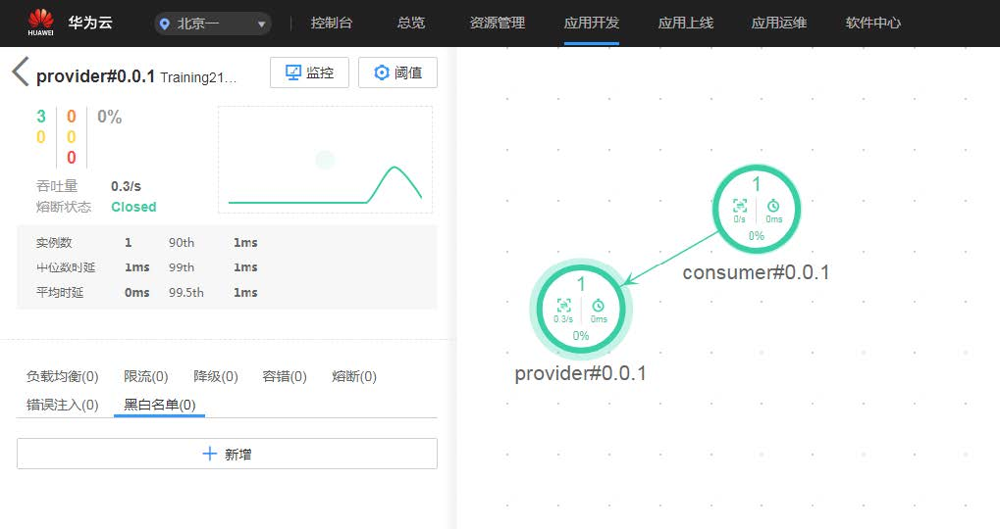

| 配置项                               | 默认值 | 说明                                                                                                                                                         |
| ------------------------------------ | ------ | ------------------------------------------------------------------------------------------------------------------------------------------------------------ |
| servicecomb.monitor.client.serverUri | 无     | 如果没有配置该地址，则会从服务中心通过服务发现的方式获取 monitor 地址。从华为云外部连接 CSE 时需要显式配置地址，在华为云上部署时推荐不配置，走 sc 服务发现。 |
| servicecomb.monitor.client.enabled   | true   | 是否连接 monitor                                                                                                                                             |

#### 通过代理连接 CSE 服务

如果开发调试环境无法直接连接华为云 CSE 服务，CSEJavaSDK 也提供了代理配置，允许通过代理连接 sc/cc/monitor 服务。参见[代理设置](https://docs.servicecomb.io/java-chassis/zh_CN/general-development/dai-li-she-zhi.html)。
代理配置在`microservice.yaml`文件中，示例如下所示：

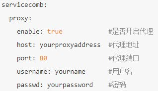

### 1.4 DAY4 微服务实例的生命周期分析

大纲

* 服务启动流程
* 服务发现
* 服务退出

#### 服务启动流程

一个微服务实例在启动过程中主要经历的流程有：

* 初始化日志框架
* 加载本地配置（包括 System Property、环境变量、配置文件）
* 实例化 Spring Bean
* 初始化 SCBEngine
* 注册服务

注册服务的流程如下：

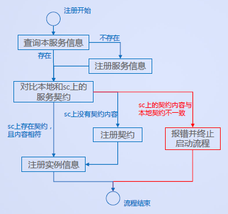

* 当 env 为默认环境或 production 环境时，不允许出现服务实例本地与 sc 上的服务契约不一致的情况（一旦契约不一致会走左图中的红色路径）
* `env=development`时，服务实例会将不一致的接口契约注册到 sc，覆盖 sc 上原有的契约（如下图）

```yaml
APPLICATION_ID: Training21Days-HelloWorld # 应用Id 是微服务的一个隔离层级，默认只有同应用下的微服务可以相互调用
service_description:
  name: provider # 微服务名称，同应用下的不同微服务需要有不同的名称
  version: 0.0.1 # 微服务版本
  environment: development # 设置为开发环境
```

当微服务实例注册到 sc 上去后，启动流程完成。如果有一些操作需要在服务启动完成时执行，可以定义一个`org.apache.servicecomb.core.BootListener`去监听事件，并在接收到`AFTER_REGISTRY`事件时触发操作的执行。

```java
@Component
public class CustomBootEventListener implements BootListener {

    private static final Logger LOGGER = LoggerFactory.getLogger(CustomBootEventListener.class);

    public void onBootEvent(BootEvent bootEvent) {
        // BootEvent中的EventType有多种
        switch (bootEvent.getEventType()) {
            case AFTER_REGISTRY: // 微服务实例注册成功
                LOGGER.info("=============================");
                LOGGER.info("Service startup completed!");
                LOGGER.info("=============================");
                break;
            case BEFORE_CLOSE:   // 微服务进程即将退出
                LOGGER.info("=============================");
                LOGGER.info("JVM process is closing!");
                LOGGER.info("=============================");
                break;
            default:
        }
    }
}
```

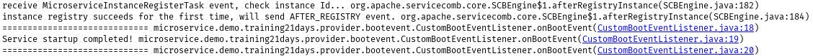

#### 服务发现

Consumer 服务调用 provider 服务时，需要去服务中心查询 provider 服务的契约、实例列表等信息，然后才能对 provider 发起调用：

* 查询条件包括 AppID、serviceName、environment、versionRule，如果碰到 consumer 端找不到 provider 服务的问题，除了检查 provider 服务的实例有没有注册到 sc，还需要检查这四个配置项是否有问题
* 查询到 provider 端服务信息后，consumer 会从 sc 下载该 provider 服务的全部契约，加载到本地
* Consumer 端加载 provider 服务信息的过程发生在 consumer 第一次调用该 provider 的时候，如果 consumer 服务的实例在启动后一直没有调用 provider，则它一直不会去 sc 查询和加载 provider 服务信息

#### 服务退出

CSEJavaSDK 向 JVM 注册了一个`shutdown hook`，以实现优雅停机，在 JVM 进程退出时进行一系列的清理操作，其中包括：

* 向服务中心注销本实例
* 停止接收请求，并等待已接受的请求处理完成

由于 JVM 的限制，要确保优雅停机功能正常触发，需要用户正常停止 JVM 进程，而不能强制杀进程。以 Linux 操作系统为例：

* `kill ${PID}` 的方式停止微服务进程可以触发优雅停机
* `kill –0 ${PID}` 的方式强制停止微服务进程则不会触发优雅停机

如果微服务实例遭遇异常情况，没有调用 sc 接口注销自身实例就停止运行。sc 会通过感知心跳超时的方式下线实例。前面的课程中提到微服务连接 sc 的配置中有心跳时间间隔和允许连续心跳失败次数这两个配置，假设心跳时间间隔为 t，允许心跳失败次数为 n，则 sc 检测到实例连续心跳失败 n+1 次的时候下线实例，从实例异常退出到 sc 下线实例的时延 T 的取值范围是`t*n < T <t*(n+1)` ，按照默认值计算为 90-120 秒


注意有些 IDE 上会提供两种停止方式，以 IDEA 为例，上面的红色方形按钮是强制退出，不会触发优雅停机。下面的图标是正常退出进程，可以触发优雅停机。

运行环境是开发环境时（`service_description.environment=development`）可以自动重新注册契约而不报错。

#### 小提示

1. 关于 Spring Bean 扫描包：有些同学可能注意到了`CustomBootEventListener`类是作为 Spring Bean 实例化的（通过`@Component`注解），但是没有哪里定义扫描包的范围。这是因为`AppMain`类启动时执行的`BeanUtils.init()`会找到 main 类所在的包，并将其加入到 Spring 扫描包范围里，而`CustomBootEventListener`在`AppMain`类所在包的子包里，所以会被自动扫描和加载。
2. 在修改 provider 接口后，如果仅重启 provider，通过 consumer 调用 provider 时会报错。这是因为 consumer 端服务只会加载一次 provider 端服务契约，时间点是第一调用 provider 服务的时候。之后不会再根据契约内容变化刷新本地加载的契约了。如果 consumer 不重启，则它仍然会把 name 作为 path 参数发送出去，导致 provider 端接受到的请求不符合它的契约要求。
3. 即使重启 consumer 后，调用 consumer 的`sayHelloRestTemplate`方法仍然会出错。这是因为 RPC 调用模式下，CSEJavaSDK 框架可以根据服务契约按顺序将请求参数填入 REST 请求的特定位置发送出去；而 RestTemplate 调用模式下，name 参数的位置是在发起调用的业务代码里决定的，如果不修改代码，name 仍然是作为 path 参数传递的。

```java
@Path("/helloRT")
@GET
public String sayHelloRestTemplate(@QueryParam("name") String name) {
    // RestTemplate 使用方式与原生的Spring RestTemplate相同，可以直接参考原生Spring的资料
    // 注意URL不是 http://{IP}:{port} ， 而是 cse://{provider端服务名} ， 其他部分如path/query等与原生调用方式一致
    ResponseEntity<String> responseEntity =
            restTemplate.getForEntity("cse://provider/provider/v0/hello/" + name, String.class);
    return responseEntity.getBody();
}
```

需要修改代码，将 name 改为从 query 参数中传递，才能成功调用 provider 服务，如下图所示：

```java
@Path("/helloRT")
@GET
public String sayHelloRestTemplate(@QueryParam("name") String name) {
    // RestTemplate 使用方式与原生的Spring RestTemplate相同，可以直接参考原生Spring的资料
    // 注意URL不是 http://{IP}:{port} ， 而是 cse://{provider端服务名} ， 其他部分如path/query等与原生调用方式一致
    ResponseEntity<String> responseEntity =
            restTemplate.getForEntity("cse://provider/provider/v0/hello?name={1}", String.class);
    return responseEntity.getBody();
}
```

### 1.5 DAY5 教你如何配置你的微服务

大纲

* `microservice.yaml`配置文件
* 环境变量、`System property`
* 动态配置
* 通过 API 获取配置
* 日志配置

#### microservice.yaml 配置文件

微服务实例启动时会从 classpath 下加载`microservice.yaml`配置文件：

* 如果多个 jar 包下都有`microservice.yaml`文件，那么他们都会被加载。
* 磁盘目录下的`microservice.yaml`配置文件的优先级高于 jar 包内的配置文件。
* 可以通过在`microservice.yaml`文件内配置`servicecomb-config-order`来指定优先级。

#### 环境变量、`System property`

微服务实例启动时也会从环境变量、系统属性中加载配置：

* Linux 系统的环境变量不允许有点号”.”，但 CSEJavaSDK 框架会自动将配置项 key 中的下划线映射为点号，因此我们可以将点转换为下划线来配置环境变量
* 环境变量的优先级高于配置文件，`System property`的优先级高于环境变量

#### 动态配置

微服务实例连接配置中心后，可以从配置中心获取动态配置：

* 动态配置的优先级是最高的，并且可以在运行时刷新
* 服务治理所使用的诸多控制逻辑也是由配置项来控制的。实现服务动态治理的方式就是通过配置中心动态下发配置项

#### 通过 API 获取配置

CSEJavaSDK 使用统一的 API 来获取配置，用户使用配置的时候，不需要关心从环境变量或者配置中心来读取配置，框架已经自动为用户从各个配置来源读取配置，并根据优先级规则将所有配置进行了合并和覆盖。

优先级：`动态配置 > system property > 环境变量 > 配置文件`

将 provider 服务的 sayHello 方法的应答的前缀从固定的"`hello.`"改为从配置项获取：

```java
private DynamicStringProperty sayHelloPrefix = DynamicPropertyFactory
    .getInstance().getStringProperty("hello.sayHelloPrefix", ""
        , notifyConfigRefreshed());

@RequestMapping(path = "/hello/{name}", method = RequestMethod.GET)
public String sayHello(@PathVariable(value = "name") String name) {
return sayHelloPrefix.getValue() + name;
}
```

在`microservice.yaml`文件中加上配置：

```yaml
hello:
  sayHelloPrefix: "Hello "
```

此时启动服务进行调用，情况如下：

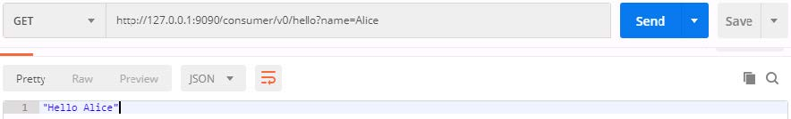

将 provider 服务的详情页面配置`hello.sayHelloPrefix=Hi`，再次调用服务发现应答已经产生变化：

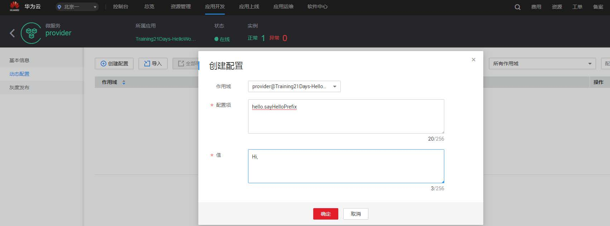


#### 日志配置

* CSEJavaSDK 默认使用的日志框架是 Log4j，并且给出了一份默认的配置，在 `org.apache.servicecomb:foundation-common` 包的 `log4j.properties` 文件内。
* CSEJavaSDK 提供了 accesslog 功能，可以在传输方式为 REST over Vertx 的条件下使用，accesslog 默认也是基于 Log4j 打印的，配置文件在 `org.apache.servicecomb:transport-rest-vertx` 包的 `log4j.properties` 文件内。
* 如果要覆盖默认的日志配置，在项目的 `resources/config` 目录下配置一份 `log4j.properties` 文件即可。

在项目的`resources/config`目录下放置一份`log4j.properties`配置文件，覆盖默认的配置，令 accesslog 的内容合并到普通业务日志中输出。

#### 注意

> **这里需要注意 CSE 是如何处理配置文件的，尤其是涉及 archaius 的配置。**

`microservice.yaml`配置文件

* 如果多个 jar 包下都有`microservice.yaml`文件，那么他们都会被加载。
* 磁盘目录下的`microservice.yaml`配置文件的优先级高于 jar 包内的配置文件，但是需要确认是哪里的目录。
* 可以通过在`microservice.yaml`文件内配置`servicecomb-config-order`来指定优先级。

> 配置文件和 jar 包在同一个目录就可以读取

环境变量、`System property`

微服务实例启动时也会从环境变量、系统属性中加载配置：

* Linux 系统的环境变量不允许有点号”.”，但 CSEJavaSDK 框架会自动将配置项 key 中的下划线映射为点号，因此我们可以将点转换为下划线来配置环境变量
* 环境变量的优先级高于配置文件，`System property`的优先级高于环境变量

动态配置

微服务实例连接配置中心后，可以从配置中心获取动态配置：

* 动态配置的优先级是最高的，并且可以在运行时刷新
* 服务治理所使用的诸多控制逻辑也是由配置项来控制的。实现服务动态治理的方式就是通过配置中心动态下发配置项

> **动态配置是如何到项目包的，是直接传输还是有配置文件在本地。**

通过 API 获取配置

CSEJavaSDK 使用统一的 API 来获取配置，用户使用配置的时候，不需要关心从环境变量或者配置中心来读取配置，框架已经自动为用户从各个配置来源读取配置，并根据优先级规则将所有配置进行了合并和覆盖。

优先级：`动态配置 > system property > 环境变量 > 配置文件`

> 这里的通过 API 获取配置就是指用 archaius 获取配置。
> 内容可能在 `foundation-config-2.1.0.jar` 和 `config-cc-2.1.0.jar`（ConfigCenter） 中

能读取`microservice.yaml`就意味着有 archaius 配置定义。

日志配置

* CSEJavaSDK 默认使用的日志框架是 Log4j，并且给出了一份默认的配置，在 `org.apache.servicecomb:foundation-common` 包的 `log4j.properties` 文件内。
* CSEJavaSDK 提供了 accesslog 功能，可以在传输方式为 REST over Vertx 的条件下使用，accesslog 默认也是基于 Log4j 打印的，配置文件在 `org.apache.servicecomb:transport-rest-vertx` 包的 `log4j.properties` 文件内。
* 如果要覆盖默认的日志配置，在项目的 `resources/config` 目录下配置一份 `log4j.properties` 文件即可。

在项目的`resources/config`目录下放置一份`log4j.properties`配置文件，覆盖默认的配置，令 accesslog 的内容合并到普通业务日志中输出。

> **日志打印的 traceId 是怎么实现的，servicecomb 就不支持默认展示。**

### 1.6 DAY6 CSE 实战之开发网关（含直播）

大纲

* 使用 `DefaultEdgeDispatcher` 开发网关服务
* 使用 `URLMappedEdgeDispatcher` 开发网关服务

#### EdgeService 网关介绍

EdgeService 是 CSEJavaSDK 提供的网关服务。网关服务可以作为微服务系统的边界，对外提供 REST 接口，将用户发送的 RESTful 请求转发给内部微服务。
EdgeService 预置了默认的请求转发模块，可以根据简明的规则将请求转发到后端微服务，也允许用户开发更复杂的自定义规则转发机制。
EdgeService 本身也是一个微服务，开发和配置方式与普通的微服务类似。用户可以通过扩展机制在 EdgeService 中定制各种业务功能。

#### 使用 DefaultEdgeDispatcher 开发网关服务

开发一个 EdgeService 网关服务所需引入的 maven 配置与开发普通微服务基本一致，只是需要多引入一个`edge-core`包的依赖：

```xml
<dependencyManagement>
<dependencies>
    <dependency>
    <groupId>com.huawei.paas.cse</groupId>
    <artifactId>cse-dependency</artifactId>
    <version>${cse.version}</version>
    <type>pom</type>
    <scope>import</scope>
    </dependency>
</dependencies>
</dependencyManagement>

<dependencies>
<dependency>
    <groupId>com.huawei.paas.cse</groupId>
    <artifactId>cse-solution-service-engine</artifactId>
</dependency>
<dependency>
    <groupId>org.apache.servicecomb</groupId>
    <artifactId>edge-core</artifactId>
</dependency>
</dependencies>
```

定义服务的`main`类和`microservice.yaml`配置文件：

* `Main`类的定义与普通微服务完全相同
* `microservice.yaml`配置文件与普通微服务基本相同，只是需要额外增加一些请求

转发规则的配置

```yaml
cse:
  http:
    dispatcher:
      edge:
        default: # 使用DefaultEdgeDispatcher开发网关服务
          enabled: true # 开启DefaultEdgeDispatcher
          prefix: rest # 匹配请求路径前缀为/rest
          # withVersion默认值就是true，这里只是展示一下，实际上可以省略该配置
          withVersion: true # 请求带版本号，例如v1表示[1.0.0,2.0.0)范围内的微服务版本
          # prefixSegmentCount默认值就是1，这里只是展示一下，实际上可以省略该配置
          prefixSegmentCount: 1 # 前缀长度，例如/rest/provider/v0/hello/Bob，去掉第一段，将/provider/v0/hello/Bob转发到后端
```

启动 edge、provider、consumer 服务，通过 edge 分别调用 provider 和 consumer，调用成功。

#### 使用 URLMappedEdgeDispatcher 开发网关服务

除了`DefaultEdgeDispatcher`，CSEJavaSDK 也提供了`URLMappedEdgeDispatcher`，允许用户指定请求 URL 和微服务的映射关系。

使用`URLMappedEdgeDispatcher`开发 EdgeService 的方法和使用`DefaultEdgeDispatcher`基本一致，只在`microservice.yaml`中的请求转发规则上有所不同。

```yaml
cse:
  http:
    dispatcher:
      edge:
        url: # 使用URLMappedEdgeDispatcher开发网关服务
          enabled: true # 开启URLMappedEdgeDispatcher
          mappings:
            providerV0: # 定义名为providerV0的映射规则
              prefixSegmentCount: 1 # 前缀长度为1，例如接到url为/hello/provider/v0/hello/Bob的请求，截去第一段发给provider
              path: "/hello/.*" # 映射规则匹配请求url的正则表达式
              microserviceName: provider # 映射规则对应转发的后端微服务
              versionRule: 0.0.0-1.0.0 # 匹配的微服务版本范围，大于或等于0.0.0，小于1.0.0
            consumerV0:
              prefixSegmentCount: 1
              path: "/client/.*"
              microserviceName: consumer
              versionRule: 0.0.0-1.0.0
```

启动 edge、provider、consumer 服务，通过 edge 分别调用 provider 和 consumer，调用成功。

#### EdgeService 网关转发机制

* 由前文可以看出，DefaultEdgeDispatcher 的配置较为简单，但对于 EdgeService 接收的请求 URL 格式有一定的要求；`URLMappedEdgeDispatcher`的转发规则较为灵活，但配置相对更繁琐一点。
* 推荐用户在设计微服务的时候预先规划好各微服务的请求 URL 格式，可以减少后期服务演进过程中碰到的接口兼容性问题。

### 1.7 DAY7 CSE 实战之框架扩展机制

大纲

* Handler 扩展机制
* Filter 扩展机制
* 异常转换扩展机制
* 请求处理流程简介

#### Handler 扩展机制

Handler 机制工作于用户业务代码接收 REST 请求之前和发送 REST 请求之后，支持默认/服务两个级别的配置。

多个 handler 之间是链式工作的，每个 handler 的 handle 方法处理完成后，由下一个 handler 继续处理该次请求。

```java
// 每个微服务 + invocationType，都对应一个handler实例
public interface Handler {
  /**
   * 每次有请求经过Handler链时，都会被这个方法处理一次
   *
   * @param invocation invocation中记录了本次请求的相关信息
   * @param asyncResp asyncResp用于异步返回处理结果
   * @throws Exception
   */
  void handle(Invocation invocation, AsyncResponse asyncResp) throws Exception;
}
```

#### Handler 扩展机制——开发一个 Handler

```java
public class DemoHandler implements Handler {
  @Override
  public void handle(Invocation invocation, AsyncResponse asyncResp) throws Exception {
    // 从这里可以取出本次请求调用的方法的完整名字，格式是 serviceName.schemaId.operationId
    String operationName = invocation.getOperationMeta().getMicroserviceQualifiedName();
    // 这里我们只检查sayHello方法的参数
    if ("provider.hello.sayHello".equals(operationName)) {
      Object name = invocation.getSwaggerArgument(0);
      // 如果name=stranger，则拒绝请求，返回403
      if (!"true".equalsIgnoreCase(invocation.getContext("LetStrangerPass"))
          && "stranger".equalsIgnoreCase((String) name)) {
        asyncResp.producerFail(new InvocationException(Status.FORBIDDEN, new CommonExceptionData("Don't know you :(")));
        return;
      }
    }
    // 通过检查，继续执行后面的逻辑
    invocation.next(asyncResp);
  }
}
```

要想使用自定义的 Handler，首先用户需要在`resources/config/`目录下放置一份`cse.handler.xml`配置文件，并在其中声明自己的 handler 的 ID 和 handler 类型。

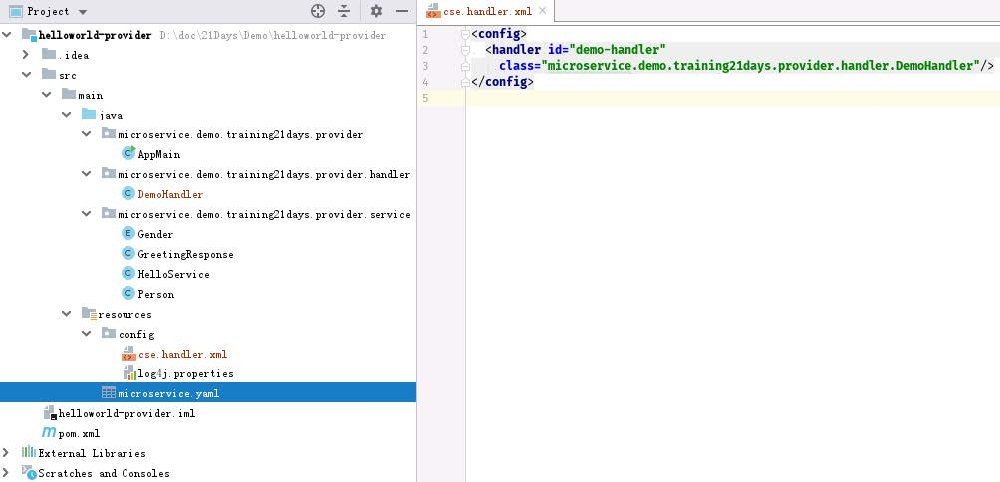

要在 handler 链中加载并使用 handler，还需要在`microservice.yaml`配置文件中显式声明 handler 链的配置，将`demo-handler`加进去。

在一开始搭建微服务时引入的`cse-solution-service-engine`包内带有一份默认的 handler 链配置，大家可以打开这个包观察一下它提供的`microservice.yaml`配置文件。为了不损失原有的功能，我们复制一份默认的 provider 端 handler 链配置，并将自己的`demo-handler`加在 handler 链的开头。

```yaml
cse:
  # 处理链配置
  handler:
    chain:
      Provider:
        default: demo-handler,qps-flowcontrol-provider,bizkeeper-provider
```

注意：consumer 端 handler 链中有一个比较特殊，就是 loadbalance，该 handler 在每次 consumer 服务准备发送请求时，从 provider 服务实例列表中选取一个实例作为本次调用的目标。如果 consumer 端 handler 链没有`loadbalancehandler`，就会在调用时碰到找不到 provider 服务实例的问题。

启动 provider 服务，调用它的 sayHello 方法，如果传入的名字不是 stranger，则 provider 返回 200 的响应；如果传入的名字是 stranger，则 provider 返回 403 响应。

#### Filter 扩展机制

* Filter 机制有两个接口，即`HttpServerFilter`和`HttpClientFilter`。
* Filter 扩展机制工作于 Handler 扩展机制的外层，`HttpServerFilter`在 provider 端 handler 前工作，`HttpClientFilter`在 consumer 端 handler 后工作。
* Filter 机制只有全局级别的生效范围。

`HttpServerFilter`中的常用方法介绍如下：

```java
public interface HttpServerFilter {
  int getOrder();

  default boolean enabled() {
    return true;
  }

  /**
   * @return if finished, then return a none null response<br>
   * if return a null response, then sdk will call next filter.afterReceiveRequest
   */
  Response afterReceiveRequest(Invocation invocation, HttpServletRequestEx requestEx);

  /**
   * @param invocation maybe null
   */
  default void beforeSendResponse(Invocation invocation, HttpServletResponseEx responseEx) {

  }
}
```

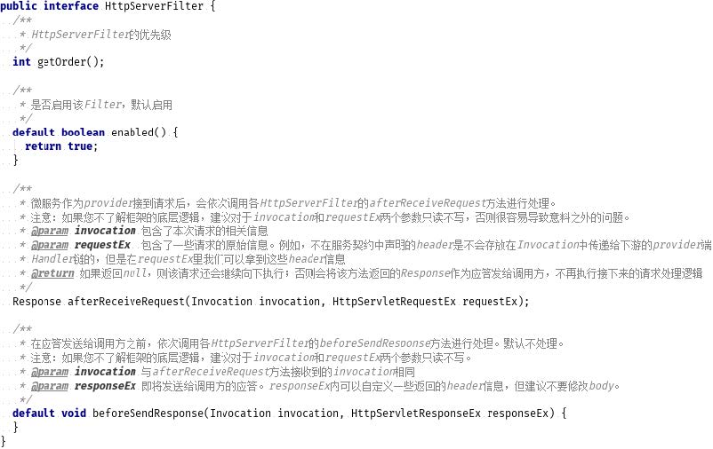

`HttpClientFilter`中的常用方法介绍如下：

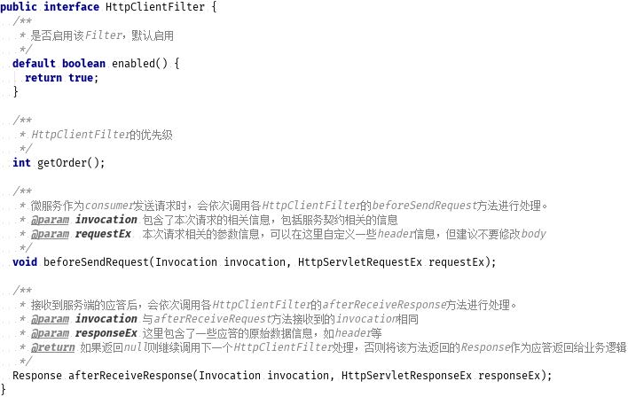

#### Filter 扩展机制——开发一个 HttpServerFilter

现在我们在 edge 服务中定义一个`HttpServerFilter`：

```java
public class DemoFilter implements HttpServerFilter {

  private static final String LET_STRANGER_PASS = "LetStrangerPass";

  @Override
  public int getOrder() {
    return 0;
  }

  @Override
  public Response afterReceiveRequest(Invocation invocation, HttpServletRequestEx httpServletRequestEx) {
    // 从请求中取出一个header
    String letStrangerPass = httpServletRequestEx.getHeader(LET_STRANGER_PASS);
    if (!StringUtils.isEmpty(letStrangerPass)) {
      // 如果此header存在则将它存入到InvocationContext中，InvocationContext可以从上游服务自动传递给下游服务
      invocation.addContext(LET_STRANGER_PASS, letStrangerPass);
    }
    return null;
  }
}
```

这里的`Filter`的目的是从请求中获取名为`LetStrangerPass`的`header`，将其存入`InvocationContext`中向下游的 provider 服务传递。

当 provider 服务的`DemoHandler`从`InvocationContext`中取出`LetStrangerPass`并且其值为 true 时，就允许 stranger 请求访问`sayHello`方法。

为了 edge 服务能够加载该 filter，我们还需要定义一份 SPI 配置文件：

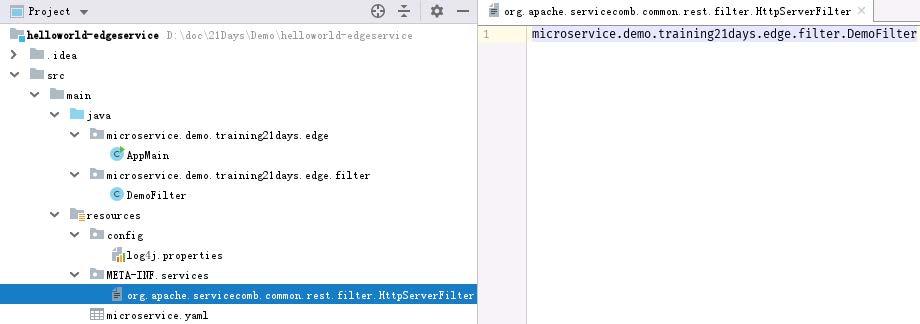

SPI 机制（Service Provider Interface）是一种 JDK 内置的服务提供发现机制。

开发者扩展了哪个接口，那么对应的 SPI 配置文件的名字必须是与该接口相同的，文件的内容是该接口的实现类的名字。

我们修改一下 provider 服务中的`DemoHandler`的逻辑，如果能从`InvocationContext`中取出`LetStrangerPass`，并且其值为 true，则允许 stranger 访问 sayHello 方法：

```java
public class DemoHandler implements Handler {

  @Override
  public void handle(Invocation invocation, AsyncResponse asyncResp) throws Exception {
    // 从这里可以取出本次请求调用的方法的完整名字，格式是 serviceName.schemaId.operationId
    String operationName = invocation.getOperationMeta().getMicroserviceQualifiedName();
    // 这里我们只检查sayHello方法的参数
    if ("provider.hello.sayHello".equals(operationName)) {
      Object name = invocation.getSwaggerArgument(0);
      // 如果name=stranger，则拒绝请求，返回403
      if (!"true".equalsIgnoreCase(invocation.getContext("LetStrangerPass"))
          && "stranger".equalsIgnoreCase((String) name)) {
        asyncResp.producerFail(new InvocationException(Status.FORBIDDEN, new CommonExceptionData("Don't know you :(")));
        return;
      }
    }
    // 通过检查，继续执行后面的逻辑
    invocation.next(asyncResp);
  }
}
```

通过 edge 调用 provider 时，如果设置`header LetStrangerPass=true`，则使用`name=stranger`的参数也可以调用`sayHello`方法。

#### 异常转换扩展机制

如果用户的业务代码抛出了`InvocationException`异常，则框架会将`InvocationException`中的 data 直接序列化为响应消息的 body。如果是其他的异常，则返回的响应消息状态码为 490/590，响应 body 为`CommonExceptionData`。我们也提供了异常转换扩展机制，允许用户捕获不同类型的异常后，将其转换为响应消息：

* 该机制允许按优先级排列和选取异常转换器
* 可以定义特定类型的异常转换器，转换该类型及其子类的异常

#### 异常转换扩展机制——开发一个异常转换器

我们来定义一个`IllegalArgumentException`的转换器作为例子。

首先我们在 provider 服务的`greeting`方法中增加一个检查，如果 person 参数的属性缺失，则抛出一个`IllegalArgumentException`。

```java
  @PostMapping(path = "/greeting")
  public GreetingResponse greeting(@RequestBody Person person) {
    GreetingResponse greetingResponse = new GreetingResponse();

    if (Gender.MALE.equals(person.getGender())) {
      greetingResponse.setMsg("Hello, Mr." + person.getName());
    } else {
      greetingResponse.setMsg("Hello, Ms." + person.getName());
    }
    greetingResponse.setTimestamp(new Date());

    return greetingResponse;
  }
```

调用 provider 服务的 greeting 方法，不传 name 字段，可以看到 provider 服务返回的状态码是 590，错误信息是`Cse Internal Server Error`，此时请求错误的信息没有展示出来。

现在我们来定义一个针对`IllegalArgumentException`的转换器

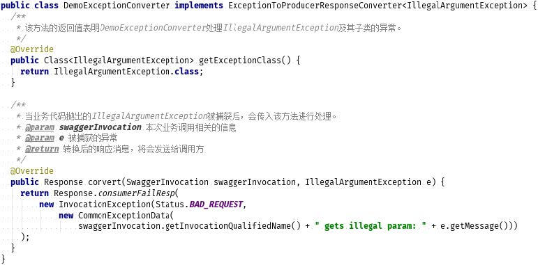

`ExceptionToProducerResponseConverter`的扩展类也是通过 SPI 机制加载的，因此需要定义一份 SPI 配置文件

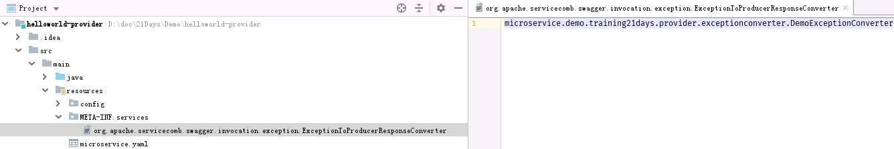

再次调用 provider 服务的 greeting 方法，此时响应消息是转换后的错误信息。

#### 请求处理流程简介

一个请求发送到某微服务，触发服务执行业务逻辑，调用下游服务方法的总体流程如图所示。

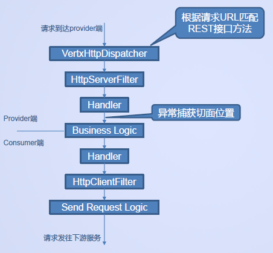

* Filter 机制只有全局作用范围，Handler 机制有全局和服务级作用范围
* 注意异常转换扩展捕获异常的位置，如果异常不是由业务逻辑抛出，而是由 Handler 等抛出的，则不在它的处理范围内
* Handler 由`handler.xml`定义加载，Filter 和异常转换机制由 SPI 机制加载，这些机制的实现类都不是由 Spring Bean 机制加载和管理的，因此`@Autowired`等 Bean 自动注入功能无法在这些扩展类里使用
* 如果要在这些扩展类里获取 Spring Bean，可以考虑使用`BeanUtils#getBean`方法，但要注意获取时机不能太早，否则可能对应的 Spring Bean 还没有被 Spring 框架实例化
* EdgeService 网关服务只有 consumer 端 handler，没有 provider 端 handler
