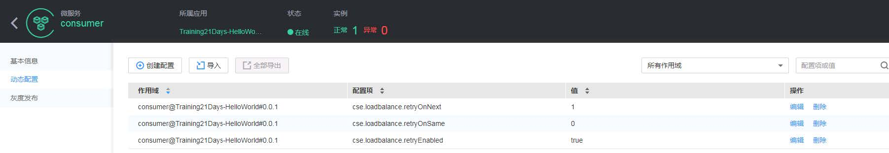
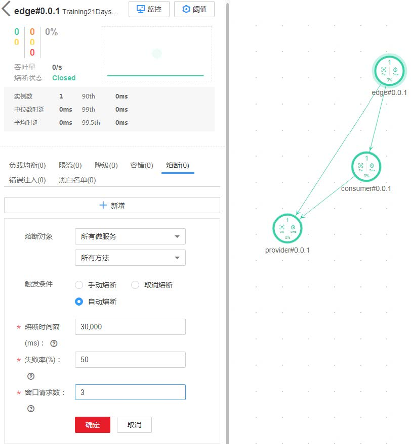
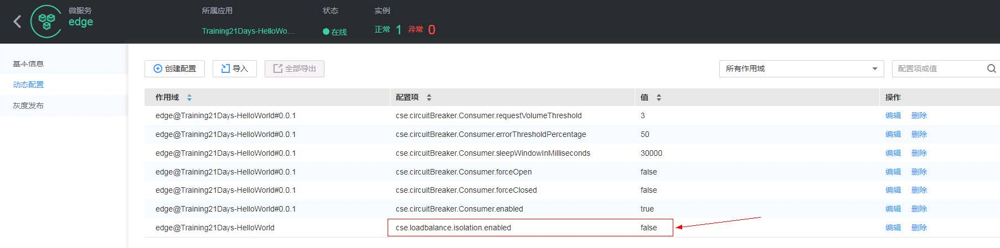
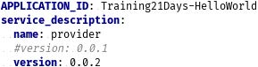
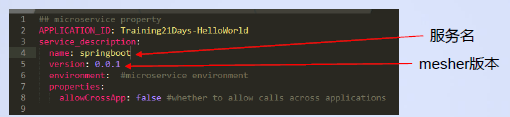

# 21 天转型微服务实战营笔记

## 第 2 章 WEEK2 微服务 CSE 多种技术实战操作

### 2.1 DAY8 CSE 实战之负载均衡

大纲

- 负载均衡策略
- 请求重试机制
- 实例隔离机制

#### 负载均衡策略

CSEJavaSDK 的负载均衡机制是客户端负载均衡：

- 微服务实例启动时会将自己的实例信息（包括 IP、端口号等）注册到 sc，并且通过心跳机制维持本实例的在线状态。
- consumer 定时去服务中心查询 provider 的实例（第一次查询发生在 consumer 第一次调用 provider 的时候，之后默认 30 秒去 sc 查一次），并缓存在本地。
- consumer 调用 provider 时会通过负载均衡机制从缓存的 provider 实例列表中选取一个作为本次请求发送的地址。
- 内置的负载均衡策略有 RoundRobin、Random、WeightedResponse、SessionStickiness，其中默认使用的是 RoundRobin。


登陆 ServiceStage 页面，依次点击“应用开发”->“引擎列表”->“控制台”->“服务治理”，在应用选择下拉框里选择“Training21Days-HelloWorld”，进入该应用的治理页面


在服务治理页面的右边点击选择 consumer 服务，将其负载均衡策略修改为“随机”

重新调用 consumer 的 greeting 方法，可以看到三个 provider 实例接收 greeting 请求的分布情况变为随机的了

#### 请求重试机制

当遭遇网络连接超时、实例下线等问题时，consumer 服务默认会尝试选择下一个 provider 服务实例进行调用，来尽量保证业务调用的成功。

- 默认的重试机制配置是`retryOnSame=0`,`retryOnNext=1`，即在同一个 provider 实例上重试零次，选择下一个 provider 实例重试一次
- 并不是所有的错误都会让 consumer 端进行重试，具体判断逻辑请参考`ServiceComb-Java-Chassis`中的`DefaultRetryExtensionsFactory`类
- 默认的重试机制配置在`cse-solution-service-engine`包的`microservice.yaml`文件中

我们可以模拟一下实例意外停止的场景来测试重试机制。
强制停止一个 provider 实例（注意不要是正常退出，否则触发实例优雅停机的话我们的可用时间窗口太短），然后调用 consumer 的 greeting 方法：


可以看到，虽然有的请求花费的时间长一点，但是仍然会调用成功的。如果观察 consumer 服务的日志，可以发现有时候 consumer 会选取那个被强制关闭的 provider 实例，但是在抛出`java.net.ConnectException: Connection refused` 异常后，consumer 会向另一个 provider 实例发送请求并调用成功。

在治理页面上我们可以动态地调整重试机制的配置，治理页面的重试机制名为容错。大家可以在页面上选择一下容错策略为 Failover，前往 consumer 服务的详情页面查看配置项


从配置项页面可以看到，Failover 策略就是默认的`tryOnSame=0`，`tryOnNext=1`策略。



Tips: 大家可以在页面上尝试一下其他的几种重试策略。CSE 的大部分治理策略都是通过配置项管理的，在治理页面上进行治理操作后，可以到这里查看对应的配置项。

#### 实例隔离机制

如果 consumer 在调用某个 provider 实例时频繁报错，则 consumer 会将该 provider 实例隔离，等待一段时间后再尝试向其发送请求。

- 默认隔离规则是连续 5 次调用某实例失败后隔离该实例
- 默认隔离 60 秒后将被隔离实例放回可选 provider 实例列表中，但当次请求是否被路由到该实例仍取决于路由策略的选择
- 如果尝试对被隔离实例进行调用时失败了，则该实例立即重新进入隔离状态，等待下一个 60 秒重试机会；调用成功则从隔离状态恢复
- 并非所有的调用失败都会计入实例隔离的判断机制里

我们仍然启动一个 consumer 实例、三个 provider 实例，先调用 consumer 的方法，测试 consumer 会正常地将请求路由到三个 provider 实例上去。

接着强制关闭一个 provider 实例，连续调用 consumer 服务，可以看到 consumer 在调用强制关闭的 provider 实例几次之后，将这个实例隔离并且不再调用了。


实例隔离触发机制除了连续调用失败，还有错误率阈值。但在某些问题场景下，出错实例会积累很高的错误率。此时如果要让每隔 60 秒的尝试调用机制将错误率慢慢拉低到阈值以下，来解除实例的隔离状态，会花费相当长的时间。因此我们推荐大家使用默认的连续调用失败机制判断实例隔离，方便问题实例的快速隔离和正常实例的快速恢复。

#### 小结

- CSEJavaSDK 的负载均衡策略是客户端负载均衡，默认策略是轮询
- 重试策略可以在 provider 端实例意外退出、网络断连时保证 consumer 端业务调用不出错。默认的重试策略是`tryOnNext=1`,`tryOnSame=0`
- 实例隔离机制可以快速将问题实例从 consumer 端的实例缓存列表中排除，减小业务调用受问题实例影响的概率
- 今天的课程所讲的内容都在 ServiceComb 开源文档中有说明，推荐阅读：https://docs.servicecomb.io/java-chassis/zh_CN/references-handlers/loadbalance.html

### 2.2 DAY9 CSE 实战之服务治理（含直播）

大纲

- 限流策略
- 服务熔断
- 服务降级
- 灰度发布

#### 限流策略

- CSEJavaSDK 支持客户端和服务端的限流策略，限制每秒钟最大请求数
- 支持 default、微服务、schema（契约）、operation（接口）限流四个粒度的限流
- 治理页面支持的是服务端微服务级限流配置
- 限流策略是实例级限流，例如，配置 provider 服务的服务端流控为 1000QPS，如果有两个 provider 服务实例，则他们可以接收共计 2000QPS 的流量


在 provider 服务上配置限流策略为对 edge 服务限流至 1QPS，通过 edge 服务连续调用 consumer 和 provider 服务。

观察 provider 服务中打印的日志，可以看到每秒钟 provider 只处理一次来自 edge 服务的请求，其他请求都以 429 状态码返回的。而对于来自 consumer 的请求，provider 正常处理并返回 200 状态码。


#### 服务熔断


- 对于一个分布式系统，如果某个请求的调用链中的某个服务出现故障，响应变慢，会导致整个链路的响应变慢，请求堆积。
- 当这种情况变得越来越严重的时候，占用的资源会越来越多，到达系统瓶颈，造成整个系统崩溃，所有请求都不可用。


- 熔断可以将问题服务隔离开，令请求可以快速返回
- 待问题服务变为正常状态后，再从熔断状态中恢复过来
  通过这种机制，我们可以临时断开次要业务路径，保障系统整体的可用性。

#### 服务熔断——手动熔断


熔断可以手动开启，也可以自动开启。其触发方式不同，但效果相同。

这里我们选择 edge 服务，手工熔断其调用 consumer 服务的 sayHello 方法的路径。

选择 edge 服务，手工熔断 edge 服务调用 consumer 服务 sayHello 方法的路径。

通过 edge 服务调用 consumer 服务的 sayHello 方法和 greeting 方法，可以看到 sayHello 方法已经调不通了，但 greeting 方法仍然能够调通


#### 服务熔断——自动熔断

我们也可以在页面上配置自动熔断规则。



默认的自动熔断规则需要在 10 秒内存在 20 次以上的调用，错误率达到 50%时触发熔断，在我们的实验中较难触发。
这里我们将熔断规则改为：

- 熔断效果维持 30 秒
- 错误率达到 50%时触发熔断
- 10 秒内有 3 个以上的请求时开始判断错误率



为了避免实例隔离机制对熔断现象的干扰，我们这里将实例隔离关闭。

TIPS：这里对熔断机制、隔离机制的调整是为了更方便地展示熔断的现象，并不是推荐的配置。如果您对于微服务熔断能力还不熟悉，建议先维持默认配置，在实践中根据实际需求再进行调整。


启动 provider、consumer、edge 服务后，在配置中心设置`delay.sayHello=40000`，多次发请求通过 edge 调用 consumer 的 sayHello 方法，触发 edge 服务到 consumer 服务 sayHello 方法请求路径的熔断。

可以看到熔断发生后，edge 调用 consumer 的 sayHello 方法不会等待 30 秒超时后再返回错误，而是立即就返回错误了


- 熔断发生后，edge 服务的熔断状态变为“Open”（可能会延迟几秒，微服务实例上报状态到 monitor 有时间间隔）
- 熔断期间，通过 edge 调用 consumer 服务的其他方法仍然是通的，只有 consumer 服务的`sayHello`方法被熔断
- 修改 consumer 服务的`delay.sayHello`配置项为 0，等熔断时间窗过后，再次调用 consumer 的`sayHello`方法，edge 的熔断状态变回“Closed”
- 注意，edge 的熔断时间窗结束后，需要等到 edge 调用 consumer 的`sayHello`方法成功，熔断状态才会结束。否则页面上仍然会一直显示熔断状态为“Open”

#### 服务降级

这里讲的降级策略是指服务调用出错时的处理策略，可以对应参考 ServiceComb 文档资料中的降级策略的容错配置。

CSEJavaSDK 提供两种降级策略，即抛出异常和返回 null，默认为抛出异常


为了让降级的效果更明显，我们将降级策略修改为`return null`


可以看到，当 edge 调用 consumer 超时时，返回的响应不再是 490 错误，而是 200，消息体为空

熔断发生后，edge 服务返回的也是空消息体


#### 灰度发布

- CSEJavaSDK 支持灰度发布功能，可以实现版本平滑过渡升级
- 支持按百分比引流和按请求参数特征引流两种方式


为了验证灰度发布的效果，我们开发一个 0.0.2 版本的 provider 服务，它的`sayHello`方法会根据时间返回不同的问候信息

修改`sayHello`方法后，升级 provider 服务为 0.0.2 版本来启动 provider 服务




将新旧版本的 provider 服务各启动一个实例，在治理页面看到的微服务情况如左图所示

此时通过 edge 连续调用`sayHello`方法，应该是新旧两个版本的应答交替返回，即两个版本的 provider 服务实例都是可用的服务实例，在轮询策略下依次被调用


进入 provider 服务的详情页面->灰度发布页面，点击添加发布规则，添加如左图所示的自定义灰度规则


### 2.3 DAY10 CSE 实战之微服务线程模型和性能统计

大纲

- 线程模型简介
- 性能统计（Metrics）

#### 线程模型简介

ServiceComb（CSEJavaSDK）是基于 Vert.x 开发的。

Vert.x 是一个依赖 Netty，具有异步非阻塞特点的框架，它是 CSEJavaSDK 高性能的基础，但也让 CSEJavaSDK 的线程模型看上去与传统的服务框架有所不同。CSEJavaSDK 线程模型的说明可以参考[开源文档](https://docs.servicecomb.io/java-chassis/zh_CN/general-development/thread-model.html)，使用 CSEJavaSDK 原生的默认开发方式时，其传输方式为[Rest over Vertx](https://docs.servicecomb.io/java-chassis/zh_CN/transports/rest-over-vertx.html)传输方式。

#### 线程模型简介——同步模型

原生的 CSEJavaSDK 框架开发的微服务默认工作于同步模式，传输方式为 Rest over Vertx 模式，基于`Vert.x`进行网络通信。

在此模式下，左图中橙色的部分是在网络线程中处理的，该部分逻辑代码是异步的，以避免阻塞网络线程；蓝色的部分是在业务线程池中处理的，可以是同步代码。

服务端方面，当请求到达微服务实例时，首先是网络线程从网络连接中接收到请求，经过一些处理后切换到业务线程运行 provider 端 handler 链、`HttpServerFilter`、用户的业务逻辑。切换到业务线程后，网络线程就可以去处理下一个请求了。这样可以使网络线程一直处于处理请求的状态，开发者要避免做阻塞网络线程的操作，如访问数据库、以同步逻辑代码发送 REST 请求等。

客户端方面，业务线程发送请求时，首先会在业务线程中对请求做一些处理（包括 consumer 端 handler 链、`HttpClientFilter`），然后转移到网络线程中进行发送。在等待应答的过程中，业务线程会一直处于阻塞状态。等到网络线程返回应答后，会通知业务线程继续运行后面的逻辑。


#### 线程模型简介——reactive 模型

除了同步模式，CSEJavaSDK 也支持[Reactive 模式](https://docs.servicecomb.io/java-chassis/zh_CN/general-development/reactive.html)，该模式下所有的处理逻辑都运行在网络线程中。为避免阻塞网络线程，provider 端服务接口代码和 consumer 端调用代码都需要是异步风格的。

Reactive 模式的开发较为复杂，用户有兴趣的话可以查阅 ServiceComb-Java-Chassis 的资料了解相关信息。

Reactive 在性能方面有着巨大的优势，但是却并非完美无缺的。它最大的问题就是要求整个项目的代码都运行于异步非阻塞的状态。一旦有一些第三方系统只有同步接口，比如某些数据库驱动三方件，那么这些地方的调用就不能直接放在业务逻辑中，否则会造成网络线程阻塞，性能打折扣。而即使使用线程池将其隔离，也会因为线程上下文的切换而带来额外开销。同时，异步风格的代码有违一般开发人员的习惯，写出来的代码可能不如传统的同步风格代码那么容易理解、调试和定位问题。

因此，是否使用 Reactive 模式进行开发，需要设计和开发人员结合实际情况进行取舍。

同步风格


- Provider 端业务接口直接返回响应消息
- Consumer 端业务代码所使用的 RPC 代理接口也是直接返回响应消息的

reactive 风格


- Provider 端业务接口返回`CompletableFuture`
- Consumer 端业务代码使用的 RPC 代理接口返回的也是`CompletableFuture`。如果要处理应答的话，在应答异步返回的时候处理

普通微服务默认都是工作于同步模式的，但是 EdgeService 网关服务默认是工作于 Reactive 模式的。因此，在 EdgeService 网关进行 handler 和 filter 扩展定制时需要注意不能阻塞线程，如进行数据库查询、文件 IO、同步网络调用等。如果有需要，可以考虑将这部分工作移到其他线程池中处理，网络调用可以改为 reactive 调用模式，或者直接将 EdgeService 网关服务的默认线程池设为普通服务所使用的同步线程池，在`microservice.yaml`文件中进行如下配置：

```yaml
cse:
  executors:
    default: servicecomb.executor.groupThreadPool
```

#### 线程模型判断

判断一个微服务的工作模式是否是 Reactive 模式，最直接的办法是在本地以 Debug 模式启动该服务，在`Filter/Handler`扩展类或者业务代码里打断点，观察线程名。例如在 edge 和 consumer 服务的`HttpServerFilter`扩展类里打断点，可以看到 filter 逻辑的执行线程名的命名格式不同：

edge 服务，reactive 模式


consumer 服务，同步模式


TIPS：在同一个微服务中，同步模式和 Reactive 模式可以并存，一部分 REST 接口方法以同步模式处理请求，另一部分以 Reactive 模式处理请求

#### 性能统计

CSEJavaSDK 自带了一个简单好用的性能统计模块，只需要在 maven 依赖中引入`metrics-core`即可使用：

```xml
<dependency>
  <groupId>org.apache.servicecomb</groupId>
  <artifactId>metrics-core</artifactId>
</dependency>
```

为开启 metrics 日志打印功能，还需要在`microservice.yaml`文件中配置：

```yaml
metrics:
  publisher:
    defaultLog:
      enabled: true # 是否在默认的日志中打印metrics日志
  window_time: 10000 # metrics日志打印周期
```

TIPS：由于引入`metrics-core`模块会增加两个契约`healthEndpoint`和`metricsEndpoint`，分别描述的是健康检查和性能数据的 REST 接口，因此需要删除服务中心里的旧服务记录以更新契约。

我们在 consumer 服务中开启 metrics 日志，重启并连续调用 consumer 服务，可以在 consumer 的日志中看到如下内容：


Consumer 服务既作为服务端接受 edge 服务的请求，也作为客户端调用 provider 服务，所以它的 metrics 日志会打印 consumer/provider 两方面的内容。

这里详细打印了连接建立、线程池工作状态、吞吐量、请求在内部各阶段的平均处理时间、最大处理时间等数据。
进行压测和性能调优时，可以打开 metrics 日志作为判断依据。

### 2.4 Day11 CSE 实战之使用 CSEGoSDK 开发微服务

### 2.5 Day12 CSE 实战之 CSEGoSDK 场景实战

### 2.6 Day13 CSE 实战之异构技术栈相互调用

### 2.7 DAY14 CSE 实战之其他服务何如接入 CSE

大纲

- 创建 springboot 服务(默认熟练运用 springboot)
- 为 Springboot 服务绑定 mesher
- CSEGoSDK 开发的 provider 和 consumer

#### 创建 springboot 服务

创建一个 maven 项目，引入 springboot 所需的 jar 包，为了方便测试，该服务需要具有两个接口一个作为服务提供者接口，另外一个作为客户端接口，该服务将和使用 CSEGoSDK 开发的服务端和客户端进行访问。


在创建好 springboot 服务后，我们需要为刚刚创建好的绑定一个 mesher，在绑定 mesher 之前，我们需要将 springboot 的代理设置为 mesher 的监听地址。本文通过 Java 的 ProxySelector 进行代理设置

```Java
public class MyProxySelector extends ProxySelector {
    @Override
    public List<Proxy> select(URI uri) {
        List<Proxy> list = new ArrayList<Proxy>();
//         设置需要进行代理的地址，此处为mesher的host和port
        String address = "127.0.0.1";
        int port = 30101;
        InetSocketAddress socketAddress = new InetSocketAddress(address,port);
        Proxy proxy = new Proxy(Proxy.Type.HTTP,socketAddress);
        list.add(proxy);
        return list;
    }

    @Override
    public void connectFailed(URI uri, SocketAddress sa, IOException ioe) {

    }
}
```

```Java
public class Application {
    public static void main(String[] args) {
        ProxySelector.setDefault(new MyProxySelector());
        SpringApplication.run(Application.class, args);
    }
}
```

#### 绑定 mesher

Springboot 服务接口以及代理均已开发好时，我们就可以为 springboot 服务绑定一个 mesher 了

1. 从华为云下载 mesher，请点击 mesher 下载
   下载解压如下：


mesher 配置

修改`microservice.yaml`,将服务名修改为 springboot，并新增`APPLICATION_ID：Training21Days-HelloWorld`



修改`chassis.yaml`,将监听地址改为机器的外部访问地址，如：`192.168.0.1`,并在该配置文件中添加 ak/sk


启 mesher:

除了使用 mesher 提供的启动脚本启动外我们亦可以直接运行`mesher.exe(mesher)`，在运行之前，我们需要设置环境变量`SPECIFIC_ADDR,SPECIFIC_ADDR`支持格式：`rest:port`,`grpc:port`，`http:port`。可同时写两个如下，设置后运行`mesher.exe(mesher)`。

e.g.

```bash
export SPECIFIC_ADDR=rest:80
```

修改完并启动 mesher 后，可以在 serverstage 下看到如下


#### 开发 CSEGoSDK 服务

我们在 Day11 时已经开发了 provider 和 consumer，此时我们可以直接使用

- 修改 Day11 中的 consumer 访问服务名为 springboot


同时按照 Day11 的启动方式将 Day11 的 provider 和 consumer 进行启动

#### 访问服务

访问 springboot 服务的 consumer 接口，`/consumer/v0/{path}`。

调用`http://127.0.0.1:9091/consumer/v0/hello/Bod`,反馈结果


访问 Day11 服务的 consumer 接口，`/consumer/v0/{path}`。

调用`http://127.0.0.1:8080/consumer/v0/hello/Bod`,反馈结果


#### 更多接入 mesher-demo 参考

- [nodejs 接入 CSE](https://support.huaweicloud.com/devg-servicestage/cse_mesh_0039.html)
- [php 接入 CSE](https://support.huaweicloud.com/devg-servicestage/cse_mesh_0047.html)
- [.Net 接入 CSE](https://support.huaweicloud.com/devg-servicestage/cse_mesh_0038.html)
- [更多](https://github.com/go-mesh/mesher-examples)

## 第 3 章 WEEK3 微服务多种应用场景实战操作

这里主要就是华为云的使用方法了。

没有代码及 ServiceComb 级别需要注意的东西。
